summary: This codelab is a guide for the SUTDAA Aid Platform, and contains guides for setting up an Ethereum account.
id: AA-Aid-Guide
categories: Meta
tags: beginner
status: Published 
authors: SUTD Alumni Association
Feedback Link: 


# AA-Aid Walkthrough


<table>
  <tr>
   <td><strong>Summary</strong>
   </td>
   <td>This codelab is a guide for the SUTDAA Aid Platform, and contains guides for setting up an Ethereum account.
   </td>
  </tr>
  <tr>
   <td><strong>URL</strong>
   </td>
   <td>aa-aid-guide
   </td>
  </tr>
  <tr>
   <td><strong>Category</strong>
   </td>
   <td>Web
   </td>
  </tr>
  <tr>
   <td><strong>Environment</strong>
   </td>
   <td>web, kiosk, io2016, pwa-dev-summit, pwa-roadshow, chrome-dev-summit-2016, io2017, typtwd17, gdd17, cds17, io2018, tag-web, jsconfeu, devfest18, io2019
   </td>
  </tr>
  <tr>
   <td><strong>Status</strong>
   </td>
   <td>Published
   </td>
  </tr>
  <tr>
   <td><strong>Feedback Link</strong>
   </td>
   <td>
   </td>
  </tr>
  <tr>
   <td><strong>Author</strong>
   </td>
   <td>SUTD Alumni Association
   </td>
  </tr>
  <tr>
   <td><strong>Author LDAP</strong>
   </td>
   <td>SUTDAA
   </td>
  </tr>
  <tr>
   <td><strong>Analytics Account</strong>
   </td>
   <td>
   </td>
  </tr>
</table>


[TOC]


---


# **AA-Aid** {#aa-aid}


**Last Updated:** 07/10/2021


## **AA-Aid?** {#aa-aid}

As members of the SUTD community, we are taught to design and build innovative products, to dive in and explore things that interest us, and to use our knowledge to creatively problem-solve. However, a common blocker that many of us face is unsurprisingly a lack of funding. In order to foster a greater culture of exploration and building, the SUTD Alumni Association has come up with AA-Aid - an open-source platform that supports SUTD's growing ecosystem through project funding.

This platform aims to solve the common issues of project funding, namely,  accountability, transparency, and longevity. As donors ourselves, we understand how futile it might feel to donate to a cause and not know what your money might be used for, or how much of it even went towards the cause. On the project side, many projects simply become one and done, with throwaway final products, destined to be repeated by a different group of juniors down the road.


## **Objectives** {#objectives}

We want a system that optimises the allocation of project donations in a very transparent manner. AA-Aid intends to connect **managers **(project managers, event organisers, fifth row leaders, etc) with **supporters **(literally anyone willing to contribute!). Instead of the traditional method of donating directly to the organisation and giving it free reign, supporters can now pick and choose the projects that they feel are worth supporting. High quality projects that provide value to the community would naturally rise to the top and hit their budget goals. This would then hopefully incentivise submitting higher quality projects.

Each project would be required to provide a breakdown of their budget and clear objectives that need to be met. Funds will only be released to the projects once they prove that these objectives are met. This provides transparency in how they will be spending the money, and also accountability in that they are unable to claim the funds and abandon the project.

Even after it ends, if relevant, the project will be archived along with its various progress updates and the final product. Anyone would be able to access these files at any time, allowing for a continuous cycle of learning and building upon previous projects.

Of course, not all projects would be work related. AA-Aid can also support community events such as funding a community outing (after Covid measures have subsided of course), or sponsoring new basketballs for the basketball fifth row. The best part is that if you don’t feel for any of these causes, you can simply choose not to participate in their funding!


```
Interested in the exact mechanisms and technologies we used to achieve this? We discuss them in detail here
```


---


# **Supporter Guide** {#supporter-guide}

Duration: 2:00


## **Basic Donation** {#basic-donation}

This will be the simplest method of supporting projects


1. Browse through projects on the notion page.
2. Once you see a project you like, take note of the **Project Id.**
3. Transfer the amount you want to donate to the SUTDAA QR code. (Please round your donation up to the nearest dollar)
4. In the transfer description, include the Project Id and the name of the donor. You can leave an empty name if you want the donation to be anonymous.
5. That’s it! We will handle the rest and ensure that the project you supported receives your donations.
6. You can check the amount donated along with your name on the project page after we are done processing it.


## **Personal Address Donation** {#personal-address-donation}

This method would require a Metamask wallet address, but will give you more flexibility in your donations.


1. Make sure you have a metamask address. If you do not know how to create one, you can follow the step-by-step tutorial provided.
2. Add the token to your metamask wallet. If you do not know how to do so, you can follow this step-by-step tutorial here (add link to tutorial)
3. Transfer the amount you want to donate to the SUTDAA QR code. (Please round your donation up to the nearest dollar)
4. In the transfer description, please include your address or ENS
5. Once the donation is processed, tokens of an equivalent amount will be transferred to your metamask wallet.
6. You can view your tokens in the **Assets **tab on metamask
7. You can now browse through projects on the notion page and donate any amount of your tokens to any listed project.
8. You can check the amount donated along with your name on the project page after the transaction is processed.

    ```
Create a metamask account tutorial here

```


---


# **Project Guide** {#project-guide}


---


# **Technical Discussion** {#technical-discussion}

This section will be discussing the technical aspects of AA-Aid along with our thoughts on certain design decisions that we made. If this does not interest you, feel free to move ahead to the next page!

At its core, AA-Aid is built on top of the ethereum blockchain.


---


# Create A Metamask Account {#create-a-metamask-account}

Duration: 3:00

This tutorial will be tailored to the browser version of metamask. We recommend using the browser over the phone applications because they are known to be pretty buggy. If you do still choose to use the phone applications, the steps will still be the same.


1. Download the Metamask browser extension from [https://metamask.io/download.html](https://metamask.io/download.html)  (Supports Chrome, Firefox, Brave, Edge)
2. Click on `Create a Wallet`

    


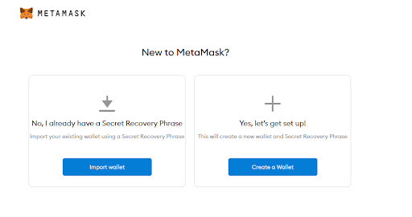


3. Come up with a super secret password and agree to the Terms of Use
4. Watch the video if that interests you, or just click on `Next`
5. Write down your Secret Recovery Phrase and **Do Not** share it with anyone ever. This phrase can be used to recover your wallet if you ever lose the credentials


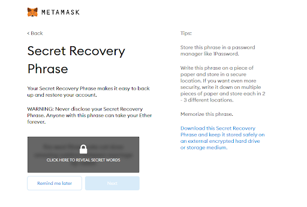


6. Once you click next, you will be prompted to write down your Secret Recovery Phrase in the correct order.
7. That’s it! Once you see this page, it means that your metamask wallet is up and running.


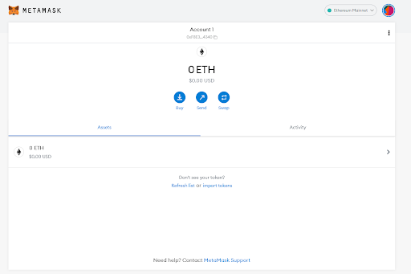


---


# Metamask Account Details and Configuration {#metamask-account-details-and-configuration}

Browser Extension: On the top right hand corner of the browser, you should be able to see this orange fox. Click on it to get a small pop up version of metamask.


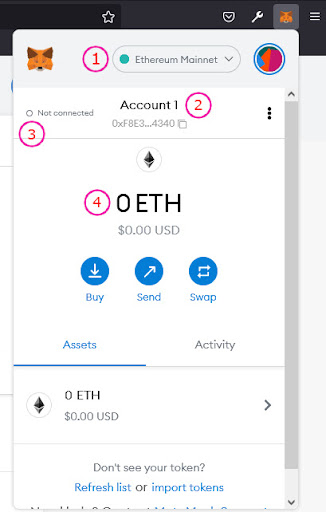


1. This is the network that you are currently using. You can switch between networks anytime.
2. This displays your wallet address. This is the address that people will use to transfer tokens to you.
3. This tells you whether or not your Metamask is connected to the website you are currently on
4. This shows you how much Eth you have in your account. You will need some Eth to make transactions.

    ```
❗IMPORTANT: Change the network to Ropsten if you want to interact with AID tokens
AA-Aids does not use the Ethereum Mainnet, but instead uses the Ropsten Test Network, which means all tokens and Ether are not real. You will not be able to convert anything on the testnet to real cash, so don't try it. But this also means that all transaction fees will be free!

```


---


# Funding Your Wallet {#funding-your-wallet}

You will need some Ether to create a new transaction. Since we are using a test network, this means that the ETH is not real. There are faucets which provide free test Eth for you to play around with. The faucets are a bit finicky and might not always work, so try your luck with another if one doesn't work for you.


## 1. [https://faucet.dimensions.network/](https://faucet.dimensions.network/) {#1-https-faucet-dimensions-network}


1. Input your address and click on `Send Ropsten Eth` and complete the captcha
2. Wait a few minutes and you should be credited Eth in your account


## 


## 2. [https://faucet.ropsten.be/](https://faucet.ropsten.be/) {#2-https-faucet-ropsten-be}


1. Input your address and click on `Send me test Ether` 
2. Wait a few minutes and you should be credited Eth in your account

    


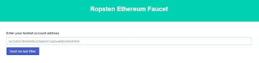


## 3. [https://faucet.metamask.io/](https://faucet.metamask.io/) {#3-https-faucet-metamask-io}


1. Click on the green button `request 1 Ether from faucet`


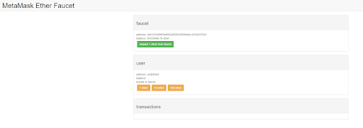


2. Connect your metamask account


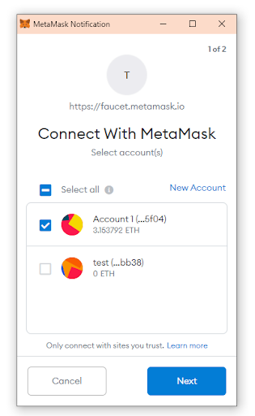


3. Wait a few minutes and you should be credited 1 Eth in your account


---


# Adding Token to Metamask {#adding-token-to-metamask}


1. Make sure you have switched to **Ropsten Test Network**
2. In the Metamask extension, click on the `Assets `tab
3. If you are on chrome, click on `Add Token `and skip to step 4


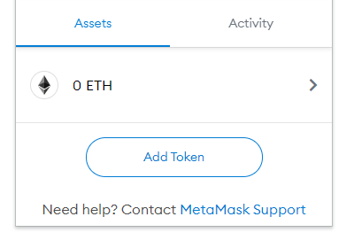


4. If you are on firefox, click on `Import Tokens`


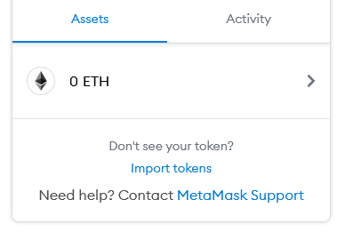


5. `Token Contract Address:` 0x737aEfd845B279eA8e2Ec9c0cd897d9d4ad49D11
6. `Token Symbol: `should be auto filled after contract address is entered
7. `Token Decimal: `1
8. Click on next and it should show you the token name


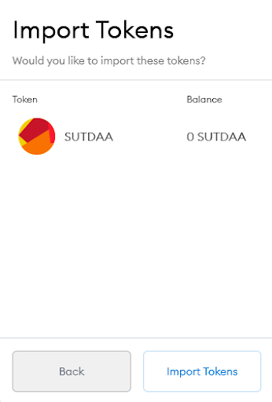


9. Finish by clicking on `Import Tokens ` and you should get this screen


10. Congrats, you can now start receiving and sending AID tokens!


---


# Creating an Ethereum Name Service {#creating-an-ethereum-name-service}


## What is an Ethereum Name Service (ENS) and why is it useful? {#what-is-an-ethereum-name-service-ens-and-why-is-it-useful}

Traditionally, an Ethereum address is a very long string of random characters that looks like this: `0x49c6a7f9F3755C810d5DDFaf029817742C46BE2b.`This address is pretty difficult to remember  and is not easily identifiable. You can register your wallet address to an ENS like `sutdaa.eth` which creates a two way mapping between your wallet address and your short name. This means that you can now interact with smart contracts with your shortened name. Think of it as instead of having to type in 69.171.250.35 (Facebook’s ip address) in your browser every time you want to rant about your terrible day, all you need to do is type in facebook.com which then reroutes you to the same Facebook page.

We want to use ENS so that it becomes easier to identify which projects belong to which addresses. For example, if a supporter wants to identify 


```
tl;dr: ENS helps map 0x49c6a7f9F3755C810d5DDFaf029817742C46BE2b to sutdaa.eth  to make it easy to remember and identify

```


## How to create an ENS? {#how-to-create-an-ens}


1. Firstly, you need an address to call your own. This can be done simply by creating a metamask account. If you haven't already done so, go look at our previous tutorial!
2. Your account needs to be funded with a little test ETH. You can follow this faucet tutorial if you are testnet broke.
3. Navigate to [https://app.ens.domains/](https://app.ens.domains/) and click the connect button on the top left. Make sure that your metamask account has already been switched to the Ropsten Test Network before connecting!

  


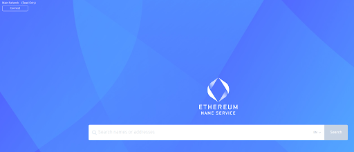


4. The site will prompt you to connect with your ethereum wallet. Click on metamask and select your account

    


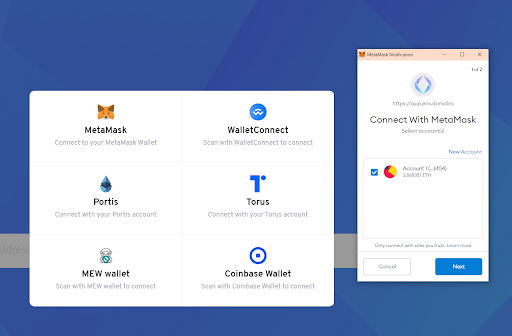


5. Once you have connected, you should notice the top left now says Ropsten Network, along with your wallet address


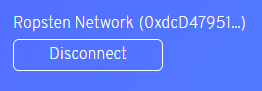


6. Search the ENS you want inside the Search Bar

    


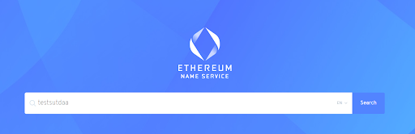


7. Click on the name that appears after you search


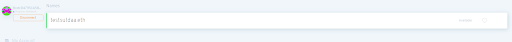


8. If you get this page, it means that the name has already been taken. Go back to the previous page and search for another one!


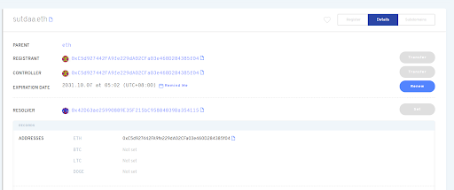


9. If you get this page, that means you can register this name as yours!


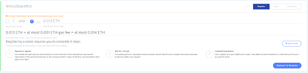


10. Change the number of years if you want. The longer it is the longer you can keep the name for, but the more test ETH it will cost. Click on `request to register` when you’re ready.
11. A metamask transaction should pop up. Click `confirm `
12. Wait for the transaction to be confirmed


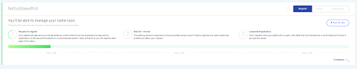


13. Once done, you should start to see the green bar fill. Wait for a minute

    


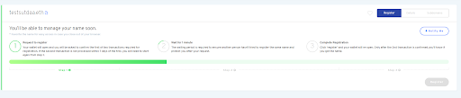


14. When the green bar stops moving, the register button should light up blue. Click on `register`


15. A second transaction should pop up. Go ahead and confirm it.
16. Click on `set reverse record`

    


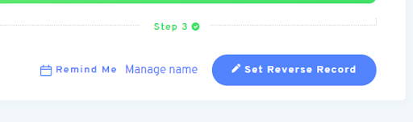


17. Select your newly created ENS in the drop down menu and click `save`


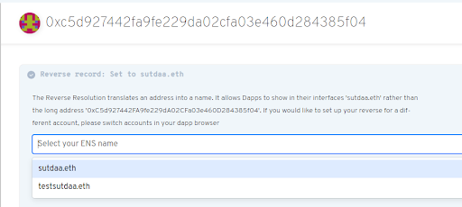


18. Again, confirm the metamask transaction
19. You should see this message saying that the reverse record was set. And you’re done! You can now use your ENS and your address interchangeably.


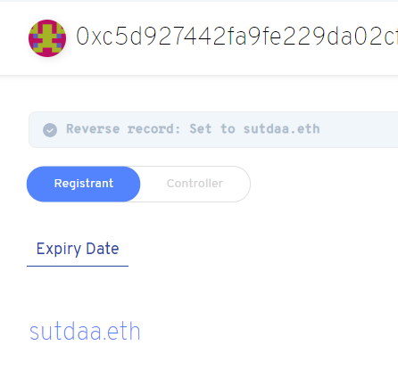


---


# Interacting with the Smart Contract {#interacting-with-the-smart-contract}


## Supporters {#supporters}


## Projects {#projects}
